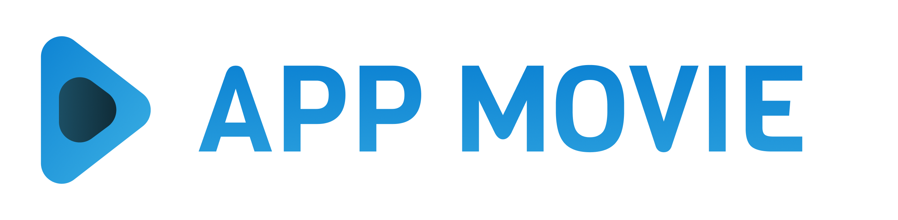
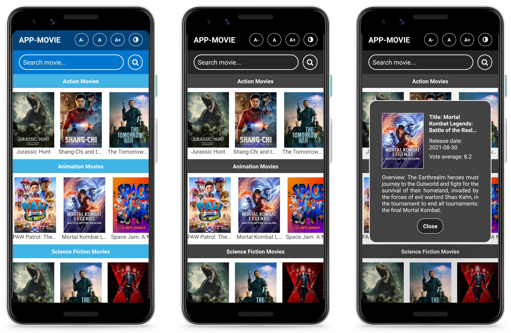

<div align="center">
  
</div>

## APP MOVIE

[](https://github.com/klayverxd)
[](#)
[](https://reactjs.org)

<h4 align="center">
  App movie é uma aplicação para busca e visualização de filmes separados em categorias. 🍿
</h4>

<div align="center">
  
</div>

## 🧪 Tecnologias
<div align="center">
  <br />
  
</div>

Este projeto foi desenvolvido usando as seguintes tecnologias:

- [React Native](https://reactnative.dev)
- [Expo](https://expo.dev)
- [Styled Components](https://styled-components.com)
- [Redux](https://redux.js.org)
- [Redux Saga](https://redux-saga.js.org)

## 👨🏽‍💻 Inicialização com Expo

**No terminal, clone o projeto e acesse a pasta da aplicação**

```bash
$ git clone https://github.com/klayverxd/app-movie.git && cd app-movie
$ expo start
```

## 🎬 API de referência
- [The Movie DB](https://www.themoviedb.org/documentation/api)
